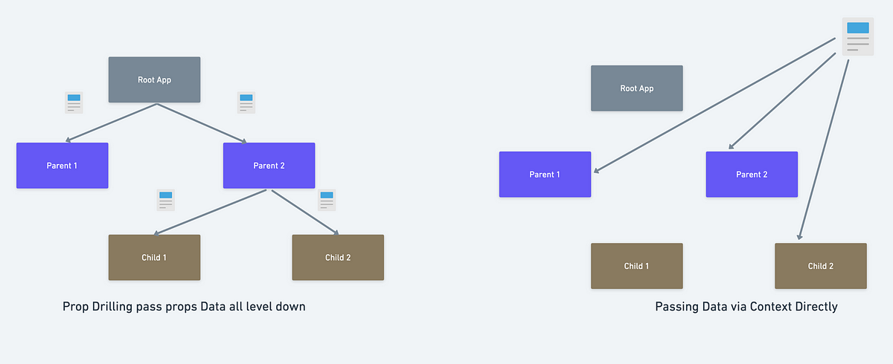

## Jargon
1. Single page application.->only the first time the page loads, everything came in the first time. Now only the components which are clicked or loaded are changed. no hard reload is done. Rendering is done at the particular component. we dont do refetching from the back end
2. Client side bundle-> html, css, js a big bundle of this all comes in.
3. Client side routing-> Only the page will be routed which we give. If we give index.html, then index.html comes, if message.html is routed, then that page opens.

Routing library: react-router-dom 
npm-> npm i react-router-dom
Let's us do routing at the client side

Sample code:
```
funcion App(){
    return(
        <BrowserRouter>
        <Routes>
            <Route path="/dashboard" element={<Dashboard>}>
            <Route path="/" element={<Landing>}>
        </Routes>
        </BrowserRouter>

    );

}

```
### ROuting
#### First Approach
Creating a button and using it to go to a Route:
```
function App() {
 
  return (
    <div>
    <button onClick={()=>{
      window.location.href="/"
    }}>Landing</button>
    <button onClick={()=>{
      window.location.href="/dashboard"
    }}>Dashboard</button> 
    <div style={{background:"black"}}>
      Hi this is top bar
    </div>  
      <BrowserRouter>
    <Routes>
    <Route path="/dashboard" element={<Dashboard/>}/>
    <Route path="/" element={<Landing/>}/>

    </Routes>

    </BrowserRouter>
    </div>
  )
}
```
But the above approach is also loading the whole page every time. How did we understand that? The chrome tab at the top of the page reloads.

#### Better approach- useNavigate
- When using useNavigate, one should not create this useNavigate hook inside the BrowserRouter.
- useNavigate needs to be a child of the BrowserRouter ALWAYS.
```
function App() {
  
  return (
    <div>
    <div style={{background:"black"}}>
      Hi this is top bar
    </div>  
      <BrowserRouter>
      <AppBar/>
    <Routes>
    <Route path="/dashboard" element={<Dashboard/>}/>
    <Route path="/" element={<Landing/>}/>
    </Routes>

    </BrowserRouter>
    </div>
  )
}
function AppBar() {
  const navigate=useNavigate();
  return <div>
    <button onClick={()=>{
      navigate("/")
    }}>Landing</button>

    <button onClick={()=>{
      navigate("/dashboard")
    }}>Dashboard</button> 
  </div>
}
```

### Lazy Loading
- This is a concept to increase efficiency.
- Basically, this approach says that only that page should be rendered which is asked for. For example, if you want to go to index.htm, then only that should be fetched. 
- And browser should fetch the dashboard only when it is requested for and same goes for any other page instead of calling all the pages all at once.

#### Suspense API
This helps to show something when we dont have the component which we want to render readily available.
So, till the time the Data/component is not there, render the fallback.

Example of using both the above concepts:
```
import { useState,React ,lazy, Suspense} from 'react'
import {BrowserRouter,Routes, Route, useNavigate} from 'react-router-dom'
import './App.css'
// import { Dashboard } from './components/Dashboard'
// import Landing from './components/Landing'

const Dashboard=lazy(()=>import('./components/Dashboard'));
const Landing=lazy(()=>import('./components/Landing'));


function App() {
  
  
  return (
    <div>
    <div style={{background:"black"}}>
      Hi this is top bar
    </div>  
      <BrowserRouter>
      <AppBar/>
    <Routes>

    <Route path="/dashboard" element={<Suspense fallback={<Loading/>}><Dashboard/></Suspense>}/>
    <Route path="/" element={<Suspense fallback={<Loading/>}><Landing/></Suspense>}/>
    </Routes>

    </BrowserRouter>
    </div>
  )
}
function AppBar() {
  const navigate=useNavigate();
  return <div>
  
  <button onClick={()=>{
      navigate("/")
    }}>Landing</button>

    <button onClick={()=>{
      navigate("/dashboard")
    }}>Dashboard</button> 

  </div>
}
function Loading(){
  return <h2>🌀 Loading...</h2>;
}

export default App

```

## Prop drilling
How should one manage State?
Ideally, one should create various main components and then child components under them.

This way the number of re render of the whole page is reduced when one of the components change.

Rule of Thumb: Push the props down as much as possible to do.

Prop Driling: Prop drilling means drilling down the components.



**Props drilling makes code unmanagable. make code look visually unappealing if the state grows big**

## Context API solves the Props drilling problem

Is there a way to pass props without passing it to every below child element? YES!! Context API!!!

```
//App.jsx

import { useState } from 'react'
import reactLogo from './assets/react.svg'
import viteLogo from '/vite.svg'
import './App.css'
import { Count } from './components/Count'
import { Countrenderer } from './components/Countrenderer'
import Buttons from './components/Buttons'
import { CountContext } from './context'
import ButtonUsingContextAPI from './components/ButtonUsingContextAPI'
function App() {
  const [count, setCount] = useState(0);

  return (
    
    <>
    {/* What if we wanted the Count component and Button component together?
    The only way to do so is passing the prop */}
      {/* <Count count={count} setCount={setCount}/> */}
      <Count count={count} setCount={setCount}/>

      {/* // wrap ayone that wants to use the "teleported value" inside a provider.

  // We have wrap anyone who wants to us ContextAPI in a Provider
  // Provider-> Provider is something which provides some value later on needed by other components. */}
  <h3>Using ContextAPI</h3>
      <CountContext.Provider value={{count, setCount}}>
      {/* We dont need to pass as a prop --> count={counterContext} . it will automatically get the value from the CounterContext.Provider */}
      <Countrenderer setCount={setCount}></Countrenderer>
      <ButtonUsingContextAPI count={count} setCount={setCount}></ButtonUsingContextAPI>
      </CountContext.Provider>
    </>
  )
}

export default App


```

- Components

```
import { useContext } from "react"
import { CountContext } from "../context"

export function Countrenderer(){
    const {count, setCount}=useContext(CountContext);
    return <div>Count is {count}</div>
} 

```

```
import { useContext } from "react";
import {CountContext} from "../context"

export default function ButtonUsingContextAPI(){
    const {count,setCount}=useContext(CountContext);
    return <div>
    <button onClick={()=>{setCount(count+1)}}>Increment</button>
    <button onClick={()=>{setCount(count-1)}}>Decrement</button>
    </div>
    
}

```

- Context.jsx

```
import { createContext } from "react";
// this helps us to "teleport" the state variable across various components
// export const CountContext=createContext({count, setCount});
export const CountContext=createContext();

```

#### Drawbacks of Context API
- For example, something changed for a child component, should the parent or any other component re render?
- SO, even though the count will not be used somewhere else in the code will re render.
- Hence, came in the State libraries to help us.

So, why use Context API?
- It makes Syntax cleaner.
- And also get rid of Prop drilling.


## State management using Recoil
- React codebase could be divided in 2 parts: State logic and component logic
- A cleaner way to store the state of our app.
- Helps how we can have separate component logic and have a state logic and then glue them together.

### Recoil
State management library for React.
helps with:
- Flexible shared state
- Derived data and queries
- App-wide state observation.

Other popular ones:
- Zustand
- Redux

Things to learn:
- RecoilRoot
- atom
- useRecoilState
- useRecoilValue
- useSetRecoilState
- selector

**Recoil gives value to 3 hooks:**
- useRecoilState: We use this when we want to have both the get and the set value. It is same as useState().
- useRecoilValue: We use this when we just want the value and dont want to update the value.
- useSetRecoilValue: We use this only when we want to update the value and not get the value

#### When to use useState vs atom?
1. For global state variables, we should ideally use Recoil
2. For input values, we could use useState.

### Selectors
- A selector represents a piece of **derived state**.
- Drevied state is a output of passing state to a pur function that derived a new value from the said state.
- If a re render happens only and only if the value of the recoil changes. We can use this when we know something completlely depends on a state variable.
```
export const evenSelector=selector({
    key:"evenSelector",
    // get is a function which has aargument which is a function which we use to get the value from countAtom
    get: ({get})=>{
        const count=get(countAtom);
        return count%2;
    }
})
//equivalent to
export const even2Selector=selector({
    key:"evenSelector",
    // get is a function which has aargument which is a function which we use to get the value from countAtom
    get: (props)=>{
        const count=props.get(countAtom);
        return count%2;
    }
})

```


