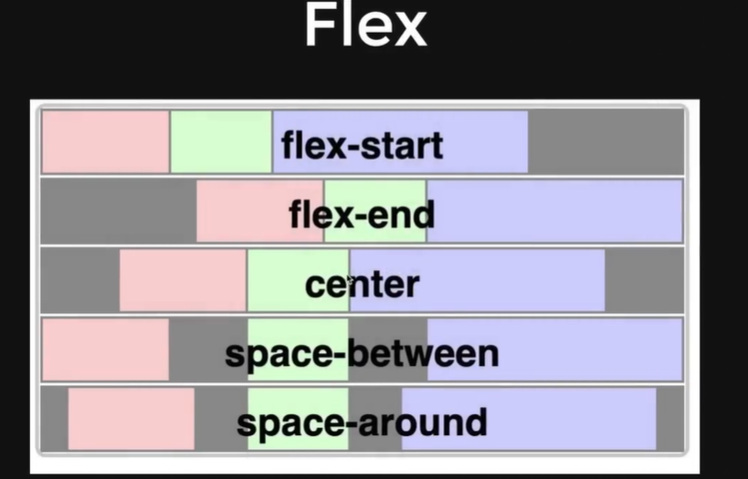

- Flex
  - Each div covers a whole row.
  - flex allows us to get div one beside the other.
  - Basically to put div in same line, then we use flex.
- justify-content: 
  - space-between: Equal space between the divs
  - flex-start: Together on the left
  - flex-end: Together goes to the end on the right
  - center: in center of the row
  - space-around: space around each div



- Grids
- Responsivness
- Background color, tex color, hover


# Tailwind CSS Notes

This repository contains personal notes and key concepts for working with Tailwind CSS, a utility-first CSS framework for rapidly building custom user interfaces. 

## Introduction to Tailwind CSS

Tailwind CSS is a highly customizable, low-level CSS framework that gives you all of the building blocks you need to build bespoke designs without any annoying opinionated styles you have to fight to override.

### Key Features

- **Utility-First**: Tailwind uses utility classes to style elements, which means you can build complex designs without writing custom CSS.
- **Responsive Design**: Tailwind's mobile-first approach makes it easy to create designs that are responsive out of the box.
- **Customizable**: Configure your design system by adjusting the `tailwind.config.js` file, which allows for a high degree of customization.

## Getting Started with Tailwind CSS

To start using Tailwind CSS in your project, you can install it via npm or include it directly in your HTML.

### Installation

```
npm install tailwindcss


<link href="https://cdn.jsdelivr.net/npm/tailwindcss@^2.0/dist/tailwind.min.css" rel="stylesheet">
```

### Core Concepts
Utility Classes
Tailwind uses utility classes to style elements. Here is how you might use utility classes to style a button:

```
<button class="bg-blue-500 hover:bg-blue-700 text-white font-bold py-2 px-4 rounded">
  Click me
</button>
```

### Responsive Modifiers
Tailwind makes creating responsive designs straightforward with responsive modifiers. For example, to change the stack direction of a flex container on different screen sizes:

html
```
<div class="flex flex-col md:flex-row">
  <div class="p-4">Item 1</div>
  <div class="p-4">Item 2</div>
</div>

```

### Customizing Tailwind
Modify the tailwind.config.js file to tailor Tailwind's design to your project's needs. For example, adding a custom color:

```
module.exports = {
  theme: {
    extend: {
      colors: {
        'custom-blue': '#243c5a',
      },
    },
  },
}
```

## Resources
1. Official Tailwind CSS Documentation
2. Tailwind CSS GitHub Repository